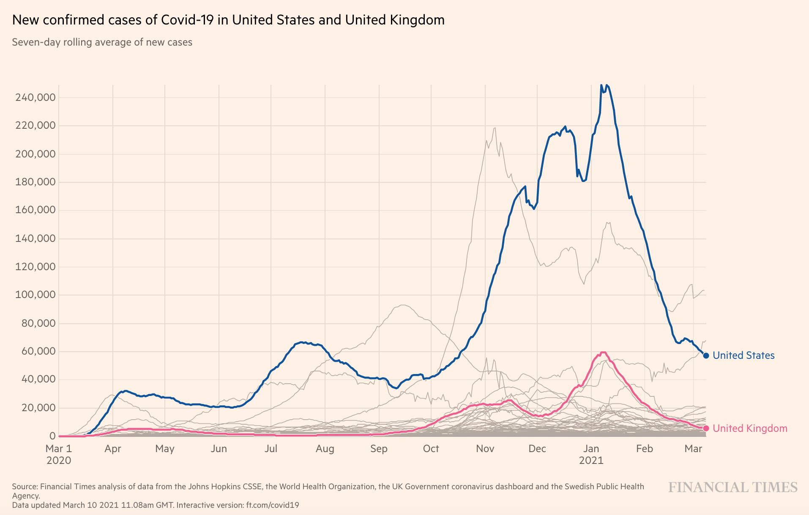
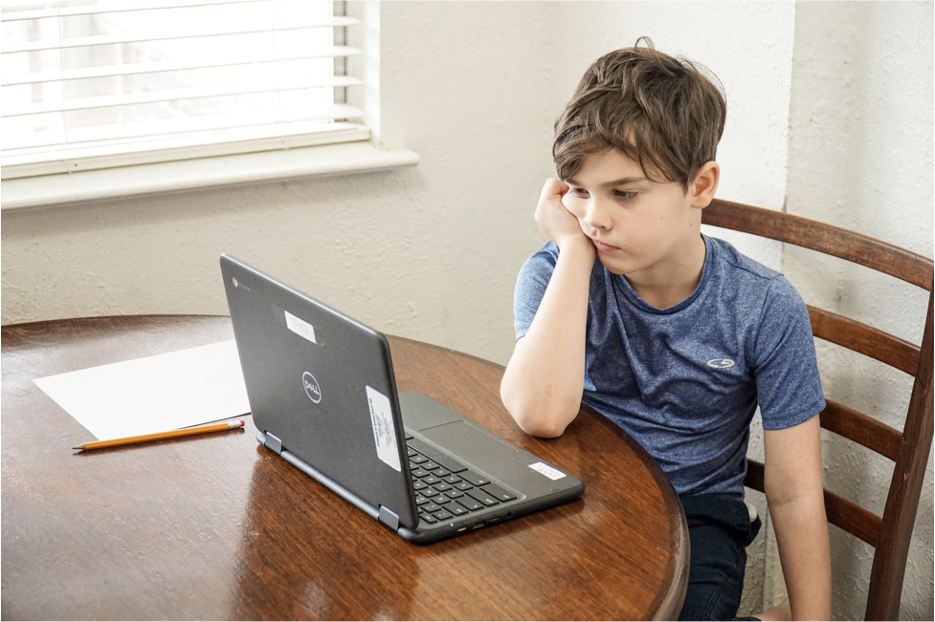
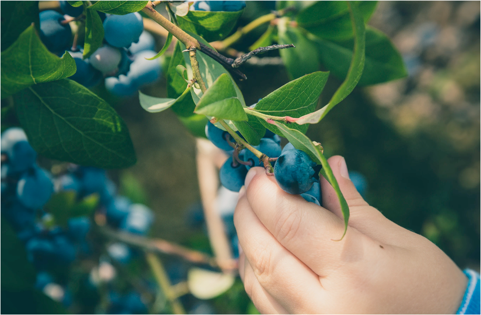
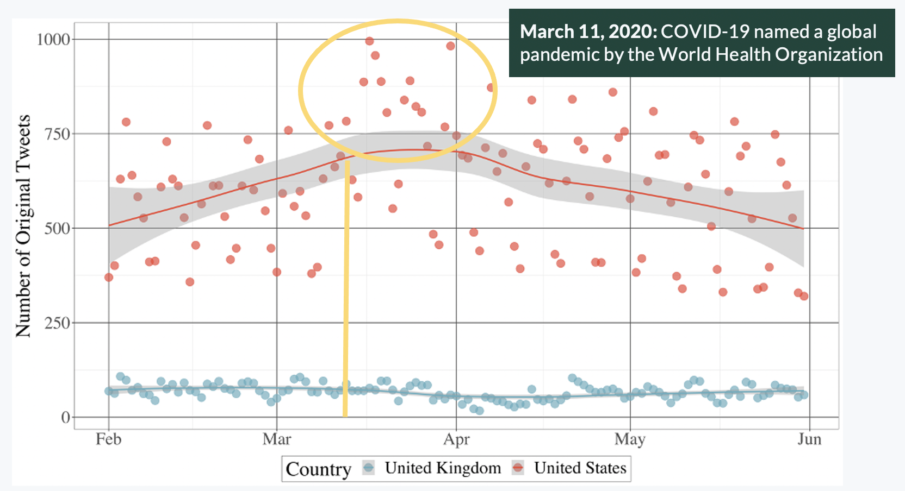
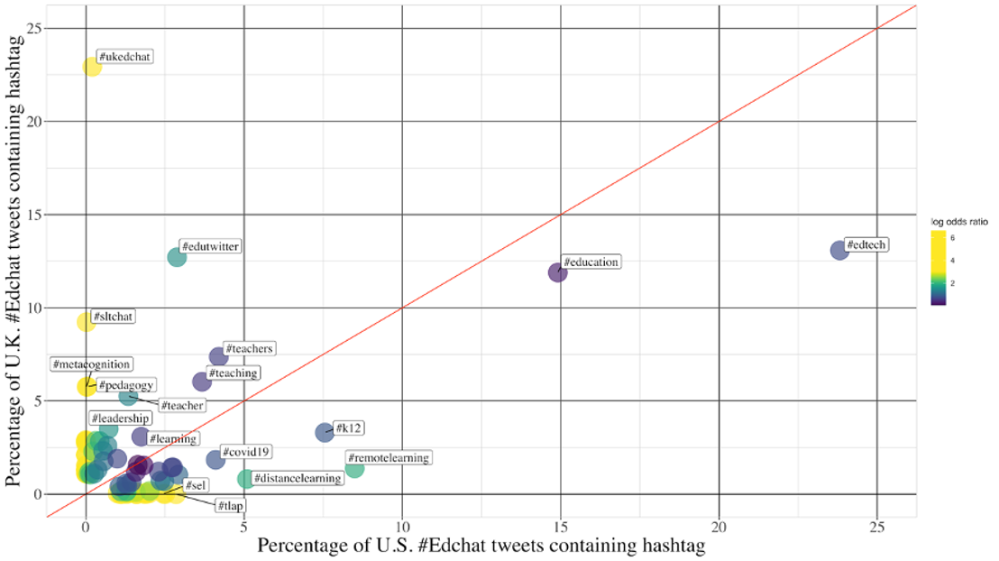
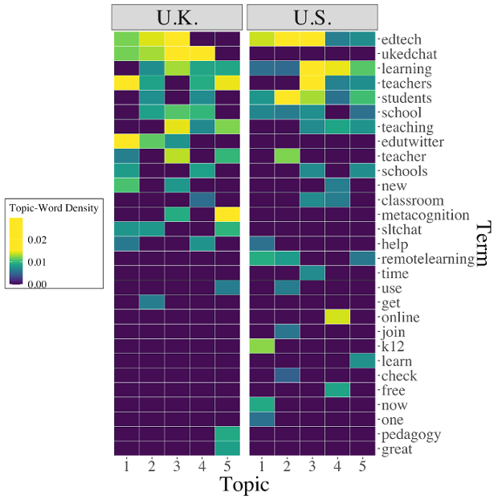
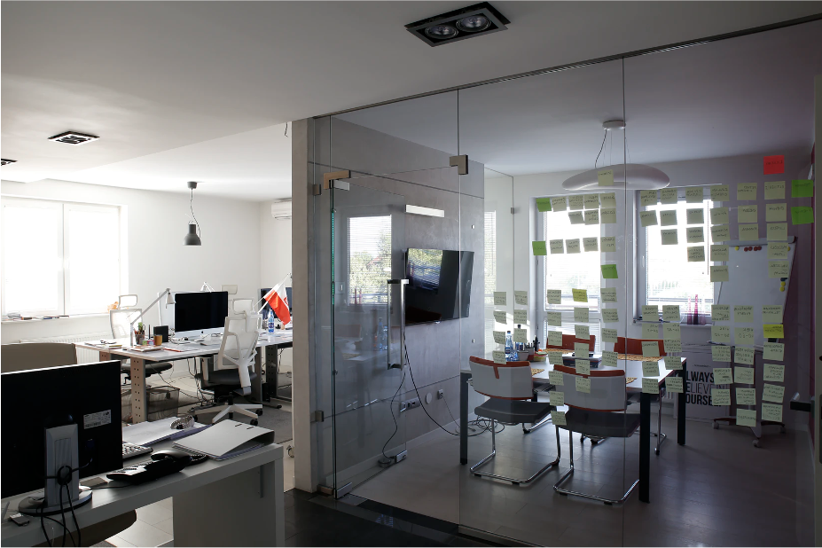
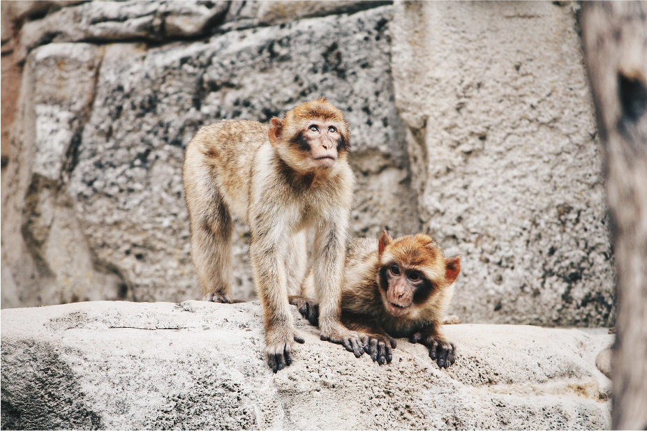

```{r setup, include=FALSE}
usethis::use_git_ignore(c("*.csv", "*.rds"))
options(htmltools.dir.version = FALSE)

#titleSlideClass: [inverse, center, middle]
#"default", "metropolis", "metropolis-fonts", 

# see options for customize slides: 
# https://slides.yihui.name/xaringan/
# https://slides.yihui.name/xaringan/incremental.html
# https://github.com/yihui/xaringan/wiki

library(knitr)
library(tidyverse)
library(xaringan)
```

class: inverse, center, middle

# View Slides

[bretsw.com/site21-covid-twitter](http://bretsw.com/site21-covid-twitter)

---

class: inverse, center, middle

# Introduction

---

# UK and US During COVID-19

```{r, out.width = "560px", echo = FALSE, fig.align = "center"}

```

<div class="caption">
<p>Image source: <a href="https://ig.ft.com/coronavirus-chart/" target="_blank">The Financial Times</a></p>
</div>

--

U.K. and U.S. have consistently been two countries most affected:

--

- Top 20 most infected

--

- Top 5 highest cumulative death totals (World Health Organization, 2020)

---

# Emergency Remote Teaching

```{r, out.width = "560px", echo = FALSE, fig.align = "center"}

```

--

- **March 10, 2020:** US shifts to online

--

- **March 11, 2020:** COVID-19 named a global pandemic by the World Health Organization

--

- **March 20, 2020:** UK shifts to online

---

# Emergency Remote Teaching

```{r, out.width = "560px", echo = FALSE, fig.align = "center"}

```

### Lack of preparation for this rapid pivot

---

class: inverse, center, middle

# Background

---

# Professional Learning Networks

```{r, out.width = "480px", echo = FALSE, fig.align = "center"}

```

--

**PLNS are:**

--

- Interactive systems of people, spaces, tools, and resources

--

- Flexible and adaptable

--

- *Build-your-own* support system

---

# Teachers on Social Media

```{r, out.width = "560px", echo = FALSE, fig.align = "center"}

```

--

Teachers adapt social media

--

to supplement and expand  their PLNs

--

for “just-in-time” learning

---

# Teachers on Twitter

```{r, out.width = "280px", echo = FALSE, fig.align = "center"}

```

--

**Affordances:**

--

- immediate participation

--

- sustained interaction and communication

--

- informal learning

--

- just-in-time reflection

--

- access to mentors

---

# Teachers on Twitter

```{r, out.width = "360px", echo = FALSE, fig.align = "center"}

```

**Hashtags:**

--

- Filter and organize information

--

- \#Edchat

---

class: inverse, center, middle

# Method

---

# Data Collection

```{r, out.width = "480px", echo = FALSE, fig.align = "center"}

```

--

**331,538 #Edchat tweets**

--

4 months: February 1 – May 31, 2020

--

118,163 (35.64%) original tweets (not retweets)

--

**8,111 tweets** from 360 UK tweeters

--

**73,859 tweets** from 2,821 US tweeters

---

# Data Analysis

```{r, out.width = "480px", echo = FALSE, fig.align = "center"}

```

--

**Natural Language Processing:**

--

1. Daily tweet count

--

2. Adjacent hashtags

--

3. Topic models (using latent Dirichlet allocation)

---

class: inverse, center, middle

# Results

---

# Daily \#Edchat Original Tweets

```{r, out.width = "840px", echo = FALSE, fig.align = "center"}

```

---

# Hashtags

### Top Hashtags in #Edchat Tweets

```{r, out.width = "720px", echo = FALSE, fig.align = "center"}

```

--

**Similar in UK and US:** #teachers, #teaching, #learning

---

# Hashtags

### Top Hashtags in #Edchat Tweets: **UK**

```{r, out.width = "720px", echo = FALSE, fig.align = "center"}

```

**Much more likely in UK:** #UKedchat, #SLTchat, #metacognition, #pedagogy

---

# Hashtags

### Top Hashtags in #Edchat Tweets: **UK**

```{r, out.width = "720px", echo = FALSE, fig.align = "center"}

```

**Much more likely in UK (although less than 3% of tweets):** #homeschooling, #homelearning, #homelearningUK

---

# Hashtags

### Top Hashtags in #Edchat Tweets: **UK**

```{r, out.width = "720px", echo = FALSE, fig.align = "center"}

```

**Somewhat more likely in UK:** #edutwitter, #leadership, #teacher

---

# Hashtags

### Top Hashtags in #Edchat Tweets: **US**

```{r, out.width = "720px", echo = FALSE, fig.align = "center"}

```

**Much more likely in US:** #tlap, #sel, #remotelearning, #distancelearning

---

# Hashtags

### Top Hashtags in #Edchat Tweets: **US**

```{r, out.width = "720px", echo = FALSE, fig.align = "center"}

```

**Somewhat more likely in US:** #k12, #covid19, #edtech

---

# Terms and Topics

```{r, out.width = "560px", echo = FALSE, fig.align = "center"}

```

---

# Terms and Topics: UK

--

1. Administrators appealing to UK educators broadly for help with new ed tech

--

2. Administrators focused on obtaining resources for their schools and students

--

3. Finding new teaching materials

--

4. Teachers looking for classroom help

--

5. Administrators trying to support teachers and teaching

---

# Terms and Topics: US

--

1. Searching with urgency (“now”) for resources that would help with remote learning in a K-12 context

--

2. Finding resources usable by a teacher to check students’ attendance during remote learning

--

3. Time-sensitive issues related to remote teaching

--

4. Educators’ search for teaching resources

--

5. Identifying more general resources for remote teaching and learning

---

class: inverse, center, middle

# Discussion

---

# Expanding PLNs

```{r, out.width = "560px", echo = FALSE, fig.align = "center"}

```

--

Tweeters from both UK and US either sought specific help or offered support

--

Social media use likely to increase during rapidly unfolding educational emergencies

---

# Expanding PLNs

```{r, out.width = "560px", echo = FALSE, fig.align = "center"}

```

**Bridging social capital:**
--

1. Widening learning context 

--

2. Hybridization of expertise

--

3. Mixing different types of information and resources

---

# Same Space, Different Purposes

```{r, out.width = "480px", echo = FALSE, fig.align = "center"}

```

--

How tweeters used #Edchat differently is likely connected to their UK and US backgrounds.

--

**Language of the news media:**

--

- UK: #homeschooling, #homelearning, #homelearningUK

--

- US: #remotelearning, #distancelearning

---

# Same Space, Different Purposes

```{r, out.width = "480px", echo = FALSE, fig.align = "center"}

```

How tweeters used #Edchat differently is likely connected to their UK and US backgrounds.

--

**Educational trends:**

--

- UK: #metacognition

--

- US: #sel

---

# Limitations and Future Research

```{r, out.width = "560px", echo = FALSE, fig.align = "center"}

```

--

\#Edchat tweets represent a large and general dataset of education-related content

--

but #Edchat is US-centric

---

# Limitations and Future Research

```{r, out.width = "560px", echo = FALSE, fig.align = "center"}

```

Future research should study hashtags explicitly associated with a particular country:

--

- **UK:** #UKedchat, #mathchat

--

- **US:** #michED, #iteachmath

---

class: inverse, center, middle

# Conclusion

---

# How PLNs Change

```{r, out.width = "600px", echo = FALSE, fig.align = "center"}

```

--

More research is needed to understand 
--
continuity and change in PLNs 

--

across temporal, spatial, institutional, and country contexts.

---

# How PLNs Change

```{r, out.width = "600px", echo = FALSE, fig.align = "center"}

```

Here, we contribute initial understanding toward 
--
a transnational strategy

--

for supporting educators’ just-in-time professional learning 

--

during global disaster situations.

---

class: inverse, left, top

# Thank you!

```{r, out.width = "720px", echo = FALSE, fig.align = "center"}

```

**Twitter:** 

- [@bretsw](https://twitter.com/bretsw)
- [@chrisgreenhow](https://twitter.com/chrisgreenhow)
- [@CathyLewin](https://twitter.com/CathyLewin)

**Slides:** [bretsw.com/site21-covid-twitter](http://bretsw.com/site21-covid-twitter)